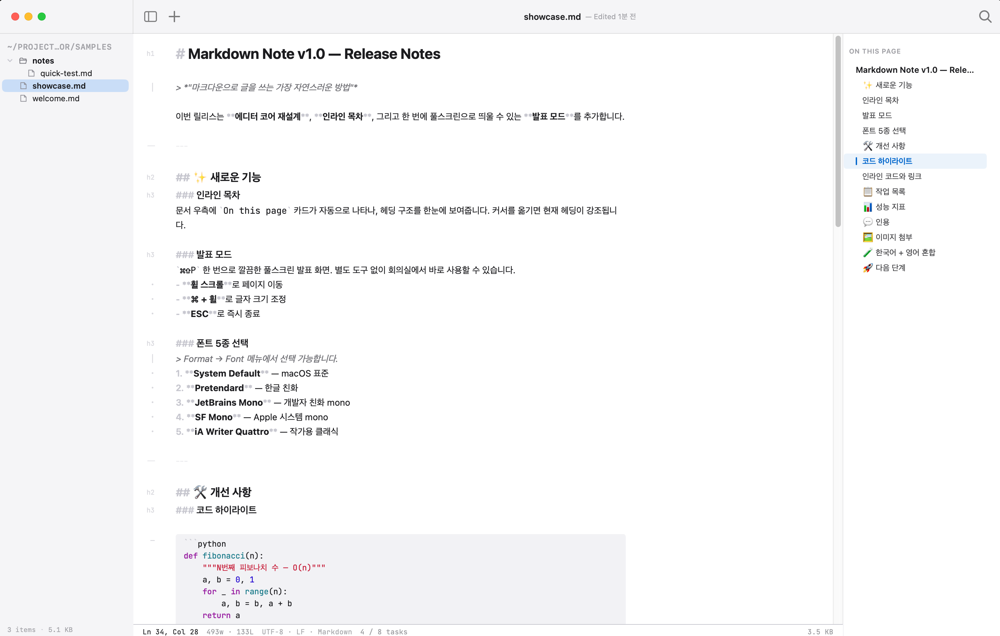

# Markdown Note

> 폴더 안의 마크다운 노트를 가장 자연스럽게 쓰고 보는 macOS 앱.

직관적인 라이브 프리뷰, 폴더 단위 노트 관리, 우측 인라인 목차, 즉석 발표 모드까지 — 글 쓰는 동안 흐름이 끊기지 않도록 설계됐다.

---

## ✨ 무엇을 할 수 있나

### 글쓰기

- **라이브 프리뷰** — `**굵게**`를 입력하는 순간 굵게, `# 제목`은 큰 헤딩으로 즉시 변환. 마크다운 마커는 흐려져 가독성을 해치지 않는다
- **풀 마크다운 지원** — 헤딩 1~6 / 리스트 / 체크박스 / 인용문 / 코드 펜스 / 링크 / 이미지 / 표 / 수평선
- **이미지 드래그 & 드롭** — 사진을 에디터로 끌어다 놓으면 `attachments/` 폴더에 자동 저장 + 마크다운 링크 자동 삽입 + 인라인 미리보기
- **검색 (⌘F)** — 현재 문서 안에서 단어 찾기 / 바꾸기

### 폴더 관리

- **폴더 단위 노트** — 노트가 들어있는 폴더를 통째로 열고, 사이드바 트리에서 탐색
- **즉석 새 파일 / 새 폴더** — ⌘N 또는 사이드바 우클릭
- **드래그 & 드롭으로 이동** — 사이드바 안에서 파일을 폴더로 끌어다 놓기
- **멀티 선택** — ⌘+클릭 / ⇧+클릭으로 여러 파일 선택, 일괄 삭제
- **파일명 즉석 변경** — 더블클릭

### 우측 목차 (On this page)

문서의 헤딩(H1~H3)이 우측에 자동으로 목차로 정리된다.

- 커서가 있는 헤딩이 **자동 강조**
- 클릭하면 해당 위치로 부드럽게 이동
- 헤딩이 없는 문서에서는 자동으로 사라짐

### 발표 모드

`⌘⇧P` 한 번이면 현재 문서가 풀스크린 발표 모드로 전환된다.

- 깔끔한 타이포그래피로 즉석 슬라이드
- **⌘ + 마우스 휠**로 확대 / 축소
- 트랙패드 핀치 줌도 지원
- ESC로 깔끔하게 종료

### 모양

- **4가지 테마** — Light / Dark / Sepia / Paper (`⌘⇧1` ~ `⌘⇧4`)
- **5가지 폰트** — System / Pretendard / JetBrains Mono / SF Mono / iA Writer Quattro
- 코드 블록은 항상 monospace 유지

### Mac답게

- **여러 노트 동시에** — `⌘T`로 새 탭, macOS 네이티브 윈도우 탭 사용
- **창 위치 기억** — 다음 실행 시 같은 자리에서 같은 크기로
- **자동 저장** — 입력 멈추면 알아서 저장
- **외부 편집 감지** — 다른 앱에서 같은 파일이 바뀌면 알림

---

## ⌨️ 단축키

| 단축키 | 동작 |
|---|---|
| `⌘O` | 폴더 열기 |
| `⌘N` | 새 파일 |
| `⌘T` | 새 탭 |
| `⌘S` | 저장 |
| `⌘F` | 문서 안 검색 |
| `⌘⇧D` | 사이드바 토글 |
| `⌘⇧P` | 발표 모드 |
| `⌘⇧1` ~ `⌘⇧4` | 테마 전환 |
| `ESC` | 검색 / 발표 모드 닫기 |

---

## 📥 설치

### 다운로드

[Releases 페이지](https://github.com/leeyunbo/Markdown-Note/releases)에서 최신 `Markdown Note.zip` 다운로드.

### 첫 실행

1. zip 더블클릭 → `Markdown Note.app` 추출
2. `/Applications/`로 드래그
3. **첫 실행만** 우클릭 > 열기 → 경고창에서 **열기** 클릭 *(macOS 보안 정책상 한 번만 필요. 이후엔 그냥 더블클릭)*

### 직접 빌드

```bash
git clone https://github.com/leeyunbo/Markdown-Note.git
cd Markdown-Note
npm install
./build.sh release
open "build/Markdown Note.app"
```

요구사항: macOS 14+, Node 18+, Swift 5.9+ (Command Line Tools 정도면 충분)

---

## 📷 Screenshots



좌측 폴더 트리 · 라이브 프리뷰 에디터 · 우측 인라인 목차 · 상단 `파일명 — Edited 1분 전` · 하단 단어/줄/태스크 카운트.

---

## 🙏 Credits

- **CodeMirror 6** — 에디터 코어
- **marked.js / highlight.js** — 발표 모드 렌더링
- **JetBrains Mono / Pretendard** — 타이포그래피
- 디자인 핸드오프 — `design_handoff_markdown_note` (Mock A "Safe") + `design_handoff_toc_inline` (variant ④)

---

Made with ☕ on macOS.
