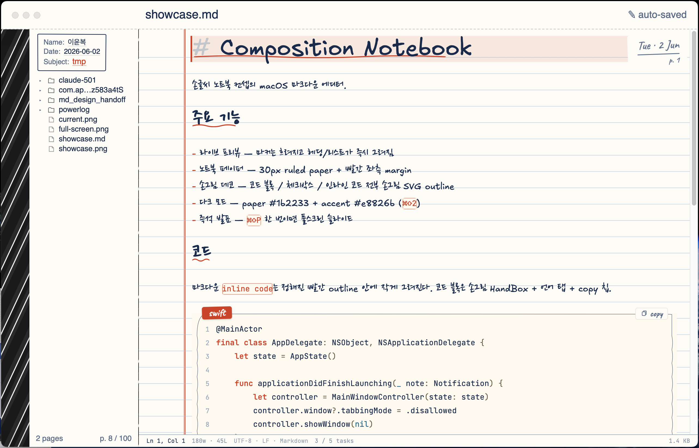

# Markdown Note

> Writing markdown should feel like writing in a notebook.



A macOS markdown editor styled like a composition notebook — ruled paper, a red margin line, a marbled book spine, handwriting fonts, and hand-drawn UI bits. Built on CodeMirror 6 in a `WKWebView`, wrapped in a native AppKit / SwiftUI shell.

---

## What's in it

### The notebook look (v2.0.0)

- **Ruled paper** — horizontal rules every 30px, red double-margin on the left
- **Marbled spine** — 52px black/white stripe down the left edge with a `Composition · 100 sheets` label
- **Handwriting** — Excalifont for Latin + symbols, Nanum Pen Script for Korean, switched automatically per glyph
- **Hand-drawn** — code blocks, inline code, headings, checkboxes, strikes — all sketched SVG instead of flat rectangles
- **Stamp box sidebar** — Name / Date / Subject like a real notebook cover, above the file tree
- **Date stamp** — shows the current file's modification date in the top right corner
- **Empty page hints** — a handwritten note with an arrow pointing at the markdown syntax cheat sheet
- **Light + Dark** — `#fdfbf5` paper / `#1b2233` ink for Day, `#c8442a` / `#e8826b` accents

### Writing

- **Live preview** — Notion/Obsidian style. Markers fade out on lines you're not on and come back when the cursor enters
- **Full markdown** — h1–h6, lists, checkboxes, blockquotes, fenced code, links, images, tables
- **Drag and drop images** — drops into `attachments/`, inserts the markdown link, shows the preview inline
- **Search** — `⌘F` in the current doc
- **Auto-save** — saves a moment after you stop typing

### Code

- JetBrains Mono with a warm syntax palette tuned for cream paper (red keywords, green types, amber strings, teal numbers)
- A hand-drawn frame around fenced blocks with a language tab on top and a copy button
- Inline code gets its own sketched outline, slightly smaller than body text

### Folder workflow

- Open a folder and use the tree to navigate
- New file / new folder / rename in place / drag to move / multi-select delete

### Presentation mode

`⌘⇧P` turns the current doc into a fullscreen slide. `⌘` + scroll wheel or pinch to zoom, `Esc` to close.

---

## Shortcuts

| Key | Action |
|---|---|
| `⌘O` | Open folder |
| `⌘N` | New file |
| `⌘T` | New window |
| `⌘S` | Save |
| `⌘F` | Find in document |
| `⌘⇧D` | Toggle sidebar |
| `⌘⇧P` | Presentation mode |
| `⌘⇧1` – `⌘⇧4` | Light / Dark / Sepia / Paper theme |
| `Esc` | Close find / presentation |

---

## Install

### Download

Grab the latest `Markdown-Note-vX.Y.Z.zip` from [Releases](https://github.com/leeyunbo/Markdown-Note/releases/latest).

### First run

1. Unzip → `Markdown Note.app`
2. Drag into `/Applications/`
3. **First run only:** right-click → Open → click Open in the warning dialog. macOS asks this once because the app isn't signed with a paid developer ID.

### Build from source

```bash
git clone https://github.com/leeyunbo/Markdown-Note.git
cd Markdown-Note
npm install
./build.sh release
open "build/Markdown Note.app"
```

Requires macOS 14+, Node 18+, Swift 5.9+ (Xcode Command Line Tools is enough).

---

## How it's built

CodeMirror 6 (TypeScript, in `Sources/CoreEditor/`) runs inside a `WKWebView`. The AppKit / SwiftUI shell in `Sources/MarkdownEditor/` owns the window, sidebar, toolbar, and file ops. They talk through a small bridge — `cm.bundle.js` is the build output esbuild stitches together.

The notebook look is mostly CSS + SVG decorations on the CodeMirror side, plus a few hand-drawn SwiftUI views (spine, stamp box) on the native side.

---

## Credits

- **[CodeMirror 6](https://codemirror.net/)** — editor core
- **[MarkEdit](https://github.com/MarkEdit-app/MarkEdit)** — reference for the NodeMatcher pattern and a few stability fixes
- **[Excalifont](https://github.com/excalidraw/excalidraw)** + **[Nanum Pen Script](https://fonts.google.com/specimen/Nanum+Pen+Script)** + **[JetBrains Mono](https://www.jetbrains.com/lp/mono/)** — fonts
- **[marked](https://marked.js.org/)** + **[highlight.js](https://highlightjs.org/)** — presentation mode rendering
- Design system — Composition Notebook handoff
