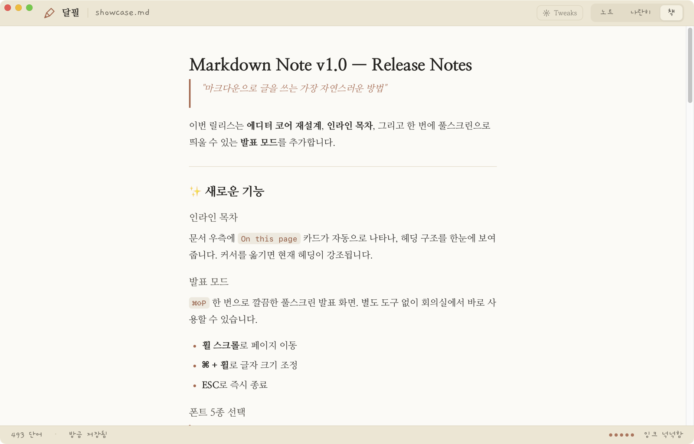
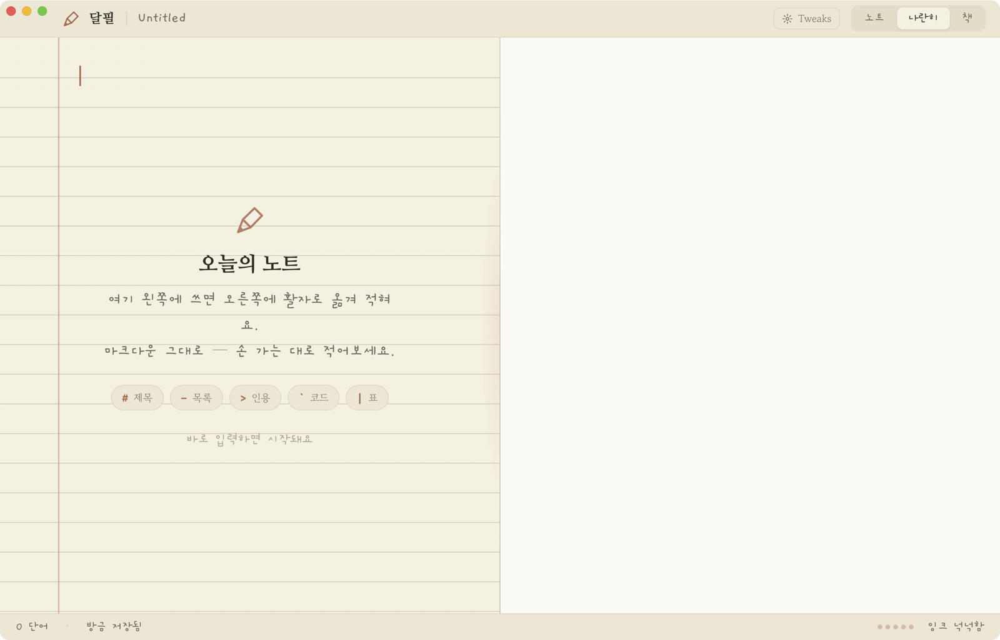

# 달필 (Dalpil)

> Writing markdown should feel like writing in a notebook — not coding in an IDE.


**달필** is a macOS markdown editor whose whole idea is the *joy of writing*. The window is split into a single metaphor: the **left pane is your handwritten notebook** (a handwriting font on warm paper), and the **right pane is the same text set in type like a finished book page**. Your draft refracts into print, in real time.

The split isn't a workaround for a buggy WYSIWYG — it *is* the product. Built on CodeMirror 6 inside a `WKWebView`, wrapped in a native AppKit / SwiftUI shell.

---

## The idea

| 노트 (left) | 책 (right) |
|---|---|
| What you type, in a **handwriting font on warm paper**. | The same markdown rendered as a clean **book page** in a serif typeface. |
| Markdown stays raw — `#`, `**`, `>`, `` ` `` are visible but faint, like pencil marks. | Real headings, pull-quotes, checkboxes, tables, syntax-highlighted code. |
| Code & tables become small monospace "cards" taped into the page. | Code blocks are dark cards with a language label and warm token colors. |

Three view modes — **노트 / 나란히 / 책** (note / split / book):



---

## What's in it

### The warm-paper look
- One committed aesthetic — warm paper and ink, terracotta accent. No cold IDE neon, no gradients, no emoji.
- **Ruled paper** with a red margin line on the left; the source reads like a real notebook page.
- Left handwriting + faint markdown tokens; right typeset in **Nanum Myeongjo** serif.

### Tweaks (header popover · persisted)
- **손글씨 폰트** — Gaegu (개구) · Nanum Pen Script (펜) · Gowun Batang (정자)
- **종이 결** — 줄 (ruled) · 모눈 (grid) · 도트 (dot) · 무지 (plain)
- **마크다운 토큰** — 보임 / 옅게 / 숨김 (how loud the `#`/`**` markers are)

### Writing
- **Live, two-pane render** — type on the left, watch it set in type on the right. Scroll stays in sync.
- **Full markdown** — h1–h6, lists, **task lists**, blockquotes, fenced code (syntax-highlighted), links, images, tables, rules.
- **Empty state** — an "오늘의 노트" card in the note pane with a blinking cursor and a syntax cheat sheet; it disappears the moment you type.
- **Status bar** — word count · save state · an "ink gauge" that fills as you write.
- **Drag & drop images** — drops into `attachments/`, inserts the link, previews inline.
- **Search** (`⌘F`) and **Quick Open** (`⌘K`).
- **Auto-save** — a moment after you stop typing.



### Folder workflow
- Open a folder and navigate the tree; new file / new folder / rename in place / drag to move / multi-select delete.

### Presentation mode
`⌘⇧P` turns the current doc into a fullscreen page. `⌘` + scroll or pinch to zoom, `Esc` to close.

---

## Shortcuts

| Key | Action |
|---|---|
| `⌘O` | Open folder |
| `⌘N` | New file |
| `⌘T` | New window |
| `⌘S` | Save |
| `⌘F` | Find in document |
| `⌘K` | Quick Open |
| `⌘⌥1` / `⌘⌥2` / `⌘⌥3` | 노트 / 나란히 / 책 |
| `⌘⇧D` | Toggle sidebar |
| `⌘⇧P` | Presentation mode |
| `⌘B` / `⌘I` | Bold / Italic |
| `Esc` | Close find / presentation |

Handwriting font, paper texture, and token visibility live in the **Tweaks** popover (and in Settings, `⌘,`).

---

## Install

### Download
Grab the latest `Markdown-Note-vX.Y.Z.zip` from [Releases](https://github.com/leeyunbo/Markdown-Note/releases/latest).

### First run
1. Unzip → `Markdown Note.app`
2. Drag into `/Applications/`
3. **First run only:** right-click → Open → click Open in the dialog. macOS asks once because the app isn't signed with a paid developer ID.

### Build from source
```bash
git clone https://github.com/leeyunbo/Markdown-Note.git
cd Markdown-Note
npm install
./build.sh release
open "build/Markdown Note.app"
```
Requires macOS 13+, Node 18+, Swift 5.9+ (Xcode Command Line Tools is enough).

---

## How it's built

CodeMirror 6 (TypeScript, in `Sources/CoreEditor/`) runs inside a `WKWebView` and is themed as handwriting-on-paper — including a view plugin that turns fenced-code and table line ranges into monospace cards. The AppKit / SwiftUI shell in `Sources/MarkdownEditor/` owns the window, the unified titlebar, sidebar, and file ops. They talk through a small bridge; `cm.bundle.js` is the esbuild output.

The preview is `marked` + `highlight.js` rendered into the typeset book page. Theme tokens are a single warm-paper palette baked into `editor.html`; the three Tweaks drive everything that changes.

---

## Credits

- **[CodeMirror 6](https://codemirror.net/)** — editor core
- **[MarkEdit](https://github.com/MarkEdit-app/MarkEdit)** — reference for the NodeMatcher pattern and stability fixes
- Fonts — **[Gaegu](https://fonts.google.com/specimen/Gaegu)**, **[Nanum Pen Script](https://fonts.google.com/specimen/Nanum+Pen+Script)**, **[Gowun Batang](https://fonts.google.com/specimen/Gowun+Batang)**, **[Nanum Myeongjo](https://fonts.google.com/specimen/Nanum+Myeongjo)** (all OFL)
- **[marked](https://marked.js.org/)** + **[highlight.js](https://highlightjs.org/)** — preview rendering
- Design — 달필 (Dalpil) handoff
